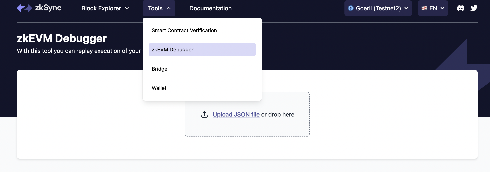

## using zkEVM Debugger

### Overview

The downside of contract execution is that it is very hard to say what a transaction did. A transaction receipt does contain a status code to check whether execution succeeded or not, but there is no way to see what data was modified, nor what external contracts were invoked. zkSync resolves this by replaying the execution of your smart contracts and collecting data about precisely what was executed by the EVM, so you can read each instruction.

The debugger page can also be accessed from the top menu.

### Debugging steps 

The current state of the debugger is empty, because no file and been uploaded, the following are the steps to follow to debug or trace a transaction:

1. Upload a JSON file:  Click on the `Upload JSON file` button and you will see a modal window with a saving prompt, or simply drag-and-drop the file into the upload dialog.
2. File upload: A loader screen is shown to indicate that the trace file is loading.
3. At a successful upload the debugger state changes to an active state.
4. To proceed to debug, click on the `Start` button.

These are some **keyboard shortcuts** to note when debugging.
- `Cmd + K`: This opens the search bar.
- `Arrows Left / Right`: This takes you to the next or previous instruction.
- `Arrows Top / Bottom`: It takes you to the next previous function inside of this contract.
- `Shift + Arrows`: It takes you to the next or previous contract